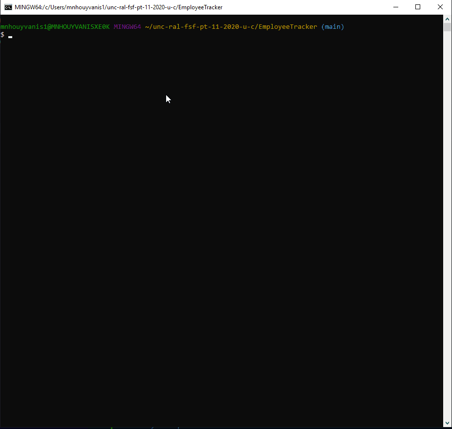

# EmployeeTracker
Solution for managing a company's employees using node, inquirer, and MySQL.

# Table of Content
- [User Story](#user-story)
- [Minumum Requirement](#minimum-requirement)
- [Installation](#installation)
- [Launch App](#launch-app)
- [Database Schema](#database-schema)
- [Database Queries](#database-queries)
- [My take](#my-take)
- [Video](#video)

# User Story
As a business owner  
I want to be able to view and manage the departments, roles, and employees in my company  
So that I can organize and plan my business

# Minimum Requirement
Functional application.  
GitHub repository with a unique name and a README describing the project.  
The command-line application should allow users to:  
- Add departments, roles, employees
- View departments, roles, employees
- Update employee roles

# Installation
```
npm init -y
npm install mysql
npm install inquirer
npm install figlet
```

# Launch App
``` node companyData.js ```

# Database Schema
```
DROP DATABASE IF EXISTS companyDB;

CREATE DATABASE companyDB;

USE companyDB;

CREATE TABLE department (
    id INT NOT NULL AUTO_INCREMENT,
    name VARCHAR(30) NOT NULL,
    PRIMARY KEY (id)
);

CREATE TABLE roles (
    id INT NOT NULL AUTO_INCREMENT,
    title VARCHAR(30) NOT NULL,
    salary DECIMAL(8,2) NOT NULL,
    department_id INTEGER NOT NULL,
    PRIMARY KEY (id),
    FOREIGN KEY (department_id) REFERENCES department(id)
);

CREATE TABLE employee (
    id INT NOT NULL AUTO_INCREMENT,
    first_name VARCHAR(30) NOT NULL,
    last_name VARCHAR(30) NOT NULL,
    roles_id INTEGER NOT NULL,
    manager_id INTEGER NULL,
    PRIMARY KEY (id),
    FOREIGN KEY (roles_id) REFERENCES roles(id),
    FOREIGN KEY (manager_id) REFERENCES employee(id)
);
```

# Database Queries

### UPDATE employee Roles
```
USE companyDB;
UPDATE employee
SET roles_id=4
WHERE id=1;
```
### UPDATE employee manager
```
USE companyDB;
UPDATE employee
SET manager_id=4
WHERE id=1;
```
### DELETE employee
```
USE companyDB;
DELETE FROM employee
WHERE id=1;
```
### DELETE roles
```
USE companyDB;
DELETE FROM roles
WHERE id=1;
```
### DELETE department
```
USE companyDB;
DELETE FROM department
WHERE id=1;
```
### query all roles
```
USE companyDB;
select r.id, r.title, r.salary, d.name
from roles r
left join department d
on r.department_id = d.id;
```
### query all department
```
USE companyDB;
select * from department;
```
### query view all employee details
```
USE companyDB;
select employee.id, employee.first_name, employee.last_name, roles.title, m.first_name, m.last_name from employee
join roles
on employee.roles_id = roles.id
join employee m
on employee.manager_id = m.id;

```
### query view total utilized budget => total salaries by department
```
USE companyDB;
select d.name 'Department Name', sum(r.salary) 'Utilized Budget'
from employee e
join roles r
on e.roles_id=r.id
join department d
on r.department_id=d.id
where r.department_id=4;
```
### query to get all managers
```
use companyDB;
select *
from employee
where id in (
select distinct manager_id
from employee
where manager_id is not null)
or manager_id is null;
```
# My take
For each CRUD, user is ask to choose which table to operate uppon.  
Also each time there is a choice a list is presented to the user for selection, like the role, department or manager list.
This option made the main file (`companyData.js`) quite big because of all the differents options.

One improvement is to seperate that file into smaller ones and exports the functions but that will require as new logic, because of the function been called by multiple other functions.

# Video
The video presentation is focusing on the CRUD operations on the Employee table. The other tables would work just as well, this is to have a shorter video length.  

